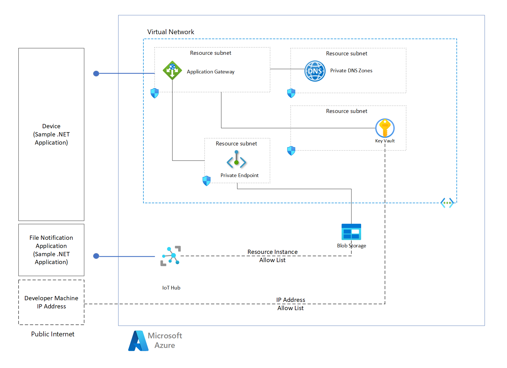

# Setting up Azure IoT Hub File Upload to Azure Storage through Private Endpoint

How to enable Azure IoT Hub's file upload functionality through an Azure Storage only allowing private connections.

The file upload functionality provided by Azure IoT Hub serves as a secure bridge to the Azure Storage account, eliminating the need for IoT client devices to rely on external custom services for secure connections to the Storage account. For a comprehensive understanding of this feature, refer to the official  [Azure IoT Hub file upload overview](https://learn.microsoft.com/azure/iot-hub/iot-hub-devguide-file-upload).

This repo offers guidance on securing Azure Storage account through a private endpoint while still allowing IoT Hub to interact with it securely, as well as allowing client IoT devices to reach the account through a gateway (Application Gateway and optionally Azure Firewall). With this approach the Storage account no longer allows public Internet access, which is a common requirement in enterprise deployments.

## Features

This project provides different options for configuring Azure IoT Hub file upload to an Azure Storage private endpoint:

* [Documentation](./docs/doc-iothub-storage-private.md) with guidance and details on how you can accomplish this configuration in a [hub-spoke network topology](https://learn.microsoft.com/azure/architecture/networking/architecture/hub-spoke), using Azure Application Gateway, and Azure Firewall for traffic inspection.
* Quickstart: Azure CLI based step-by-step scripts with a simplified setup (single virtual network & resource group) and sample client application.

## Getting Started

### Prerequisites

* An Azure subscription. If you don't have an Azure subscription, [create one for free](https://azure.microsoft.com/free/) before you begin.
* Azure subscription RBAC permissions: either Contributor role, or if using an existing resource group, use an identity that has **Microsoft/Authorization/roleAssignments/write** permissions at the resource group level.
* [Azure Command Line](https://learn.microsoft.com/cli/azure/install-azure-cli).
* Visual Studio Code installed on your development machine. For more information, see [Download Visual Studio Code](https://code.visualstudio.com/download).
* [OpenSSL Command Line Tool](https://github.com/openssl/openssl?tab=readme-ov-file)
* Bash terminal, on Windows you can use WSL
* [.NET SDK 8](https://dotnet.microsoft.com/en-us/download/dotnet/8.0) (if you wish to run the client and server samples for file upload)
* DNS provider if you wish to test HTTPS with your custom domain, and SSL Certificate for your custom domain

> [!TIP]
> Without a custom DNS and an SSL certificate available, you can still test the entire setup but the IoT client device portion of this quickstart will not be completed.

### Quickstart



This quickstart provides instructions on how to set up Azure IoT Hub's file upload functionality through an Azure Storage account that only allows private connections, through step-by-step scripts. The scripts deploy and configure a simplified set of Azure resources to showcase Azure Storage with private endpoint, Application Gateway and Azure IoT Hub routing to Azure Storage. The Storage account disables any public Internet access and only accessible within the Virtual Network. In this quickstart there is no Azure Firewall for traffic inspection.
Finally, two sample .NET apps interact with the resources deployed to showcase the end-to-end data flows.

> [!WARNING]
> This sample currently generates self-signed certificate and key files on disk and stores these on Azure Key Vault. In a production environment usage of self-signed certificates is not an option, though we would still recommend leveraging Azure Key Vault for storing the secrets.

#### Setup

1. Open a Bash terminal.
1. Clone this repository and go to the root directory.

   ```bash
   git clone https://github.com/Azure-Samples/azure-edge-extensions-iothub-fileupload-privatelink
   cd azure-edge-extensions-iothub-fileupload-privatelink
   ```

1. Open the project in Visual Studio Code and open a Bash terminal inside.

1. Log into your Azure account and select your subscription.
 
    ```bash
    az login [--tenant xxxx-xxx]
    ```

1. Prepare required environment variables to run the deployment scripts. We create a file in the folder `./temp` which is excluded from Git.

1. Create the `./temp/envvars.sh` file. For `LOCATION` you can choose any Azure region supporting IoT Hub and Application Gateway.

    ```bash
    if [ ! -d "./temp" ]; then
        mkdir ./temp
    fi
    >./temp/envvars.sh cat <<EOF
    # change the below set to match your environment based on Readme
    export TENANT_ID="xxx-xxxx-xxx-xxxx-xxxx"
    export LOCATION="westeurope"
    export PREFIX="xxx"
    export RESOURCE_GROUP="rg-xxx-xxx"
    EOF

    code ./temp/envvars.sh
    ```

   The newly created `.sh` file should now open in Visual Studio Code.

1. Edit the values to your preference, ensure `TENANT_ID` corresponds to your Azure tenant.

1. Set `PREFIX` to a short 5-character string that is unique for the resource name composition.

1. Load the variables.

    ```bash
    source ./temp/envvars.sh
    ```

#### Azure Resources with Virtual Network, private Key Vault, private Storage and Application Gateway

Deploy the Azure components for setting up Virtual Network, self-signed SSL certificate, Storage, Private Link, custom private DNS and Application Gateway configured to talk to the Storage account. This allows you to validate the flow before configuring Azure IoT Hub and client communication. The SSL certificate is stored in Azure Key Vault.

> [! WARNING]
> [Azure Key Vault in this sample has network rules to deny public internet access, but has an exception to allow the current user's IP address for this quickstart setup. In real environments we recommend removing this rule and integrating your service access through [Private Endpoint](https://learn.microsoft.com/en-us/azure/key-vault/general/private-link-service?tabs=portal).]

1. From the root directory of this repo, run the first part of the deployment. The script will use the environment variables and build composed resource names by appending the `PREFIX` variable as Azure resource names.

```bash
./deploy/quickstart-agw-storage.sh
```

2. It will take a few minutes to deploy all resources. Keep the terminal open and take note of some of the generated DNS entries.
3. This scripts also uploads a `sample.txt` file to a Blob storage container and generates a SAS URI token for testing.
4. From a bash terminal, try out a `CURL` command to the DNS of the Public IP address attached to the Application Gateway.

```bash
curl --insecure "<APP_GATEWAY_SASURI copied output>"
```

5. Run the same command with the Blob Public URI printed out by the script `BLOB_SASURI` value. Verify this does not succeed since this Storage account is blocking direct Internet traffic.
6. Configure your custom DNS (through your DNS provider) and SSL certificate for end-to-end SSL encryption.

   1. Ensure you create a `CNAME` or `A` Record pointing to the DNS of the Azure Public IP created above.
   2. `CNAME` is the simpler approach and you can point it to the value output of the script in the form of `xxx.<region>.cloudapp.azure.com`.
   3. Create an SSL certificate for this domain, or ensure you have a valid wildcard domain.
   4. Export the PFX file into a base64 encoded file. For example `base64 -w 0 ./temp/<YOURFILENAME_LOCATION>.pfx > ./temp/<YOURFILENAME_LOCATION>.pfx.base64`.
   5. Update the Key vault secret:

    ```bash
    keyvault_name="kv-$PREFIX"
    az keyvault secret set --vault-name $keyvault_name --name "AppGatewayCertPfx" --file ./temp/<YOURFILENAME_LOCATION>.pfx.base64 --content-type "application/x-pkcs12"
    ```

   6. Application Gateway polls the Key Vault every four-hour interval. You might need to force this to be sooner by updating a rule, listener or setting on the Application Gateway. See [Supported certificates - Tip](https://learn.microsoft.com/en-us/azure/application-gateway/key-vault-certs#supported-certificates).
   7. Test the name resolution works for your CNAME record and directs to the Public IP address used by the application gateway.
   8. If you want to ensure the SSL certificate from Key Vault is up to date and refreshed in Application Gateway, use OpenSSL to verify the currently attached certificate. You can also go the the Azure Portal, select the Application Gateway instance. In the Listeners section, choose Listener TLS certificates and note the Common Name and expiry of the `appGatewaySslCert`, should match your custom certificate.

    ```bash
    openssl s_client -connect <yourcustommappeddomain>:443 -showcerts </dev/null
    ```

   6. Finally, test the custom URL and SAS URI without `--insecure` option as end to end SSL is now configured. the `CURL` should now be successful.
  
    ```bash
    curl "https://<yourcustommappeddomain>/test/sample.txt?<SAS>"
    ```

#### Azure IoT Hub deployment and configuration

Deploy Azure IoT Hub and configure service communication to Azure Storage for File upload functionality.

> [!TIP]
> If you don't have custom DNS and SSL setup completed, use a dummy value when calling the script.

1. Run the following script to deploy and configure Azure IoT Hub and Storage. The names of the resources are identical to the first script and composed by the environment variables loaded upfront.

```bash
./deploy/quickstart-add-iothub.sh "<your_custom_dns>"
```

2. The script will output a sample device connection string, and a service connect endpoint connection string. You will use these in the IoT client sample.

#### IoT Client sample

> [!WARNING]
> It is a prerequisite to have a valid DNS custom domain and associated SSL certificate configured for this part to work. If you don't have this requirement, we recommend you review the [sample code projects](./src/) and the flow to understand the process.

To validate a client device on public Internet can leverage file upload with a custom domain mapping, you will use two Terminal windows to run a client and a server .NET sample app.

Run the File Upload notifications server application:

1. In a new terminal go into the application directory

   ```bash
   cd ./src/ServerSideFileNotification/
   ```

1. Build the .NET app.

   ```bash
   dotnet build
   ```

1. Run the sample application.

   You will need to pass in the Service connection string from the `./deploy/quickstart-add-iothub.sh` script.

   ```bash
   dotnet run "<iot hub service connection string>"
   ```

4. Leave this application running.

Run the IoT Client sample application:

1. In a new bash terminal `CD` into the directory `./src/SampleIoTClientFileUpload/`.
2. Prepare a `.env` file for the required variables:

```bash
>.env cat <<EOF
IOT_HUB_HOSTNAME="TODO.azure-devices.net"
IOT_HUB_CONNSTRING="TODO"
DEVICE_ID="myDeviceOne"
AUTH_TYPE="symmetric_key"
EOF
    
code .env
```

3. Ensure you replace the variable contents based on values output by the IoT Hub creation script.
4. Build the .NET application: `dotnet build`.
5. Run the .NET client application: `dotnet run`.
6. Review the upload is successful.
7. Switch to the terminal running the server application and note the notification has arrived.

### Clean-up Azure resources

This quickstart deploys all Azure resources within a single resource group. It's enough to delete the resource group to clean-up all cloud resources. From the terminal where you ran the scripts:

```bash
az group delete --name $RESOURCE_GROUP
```

## Resources

* [Microsoft Learn | Upload files with IoT Hub](https://learn.microsoft.com/azure/iot-hub/iot-hub-devguide-file-upload)
* [Azure Architecture Center | Hub-spoke network topology in Azure](https://learn.microsoft.com/azure/architecture/networking/architecture/hub-spoke?tabs=cli)
* [Microsoft Learn | Configure Azure Storage firewalls and virtual networks](https://learn.microsoft.com/azure/storage/common/storage-network-security?tabs=azure-cli)
* [Using Azure Application Gateway to map custom domain names to Private Endpoint enabled PaaS services](https://techcommunity.microsoft.com/t5/azure-architecture-blog/using-azure-application-gateway-to-map-custom-domain-names-to/ba-p/4025898)
