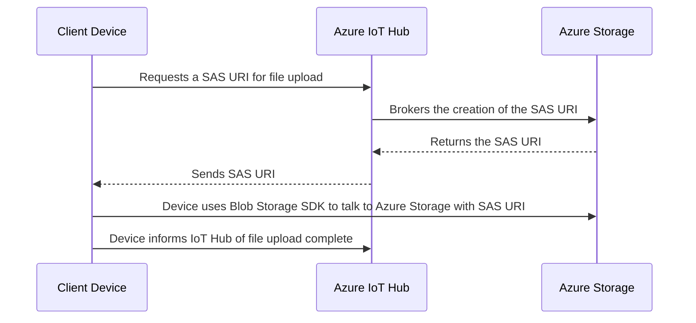
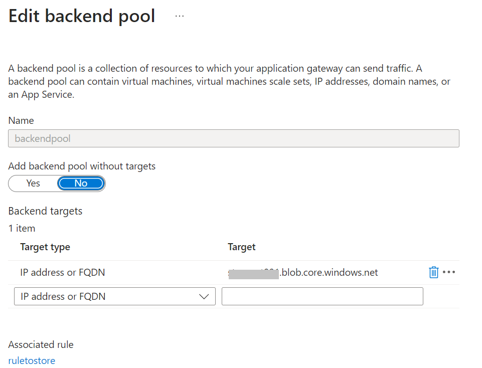
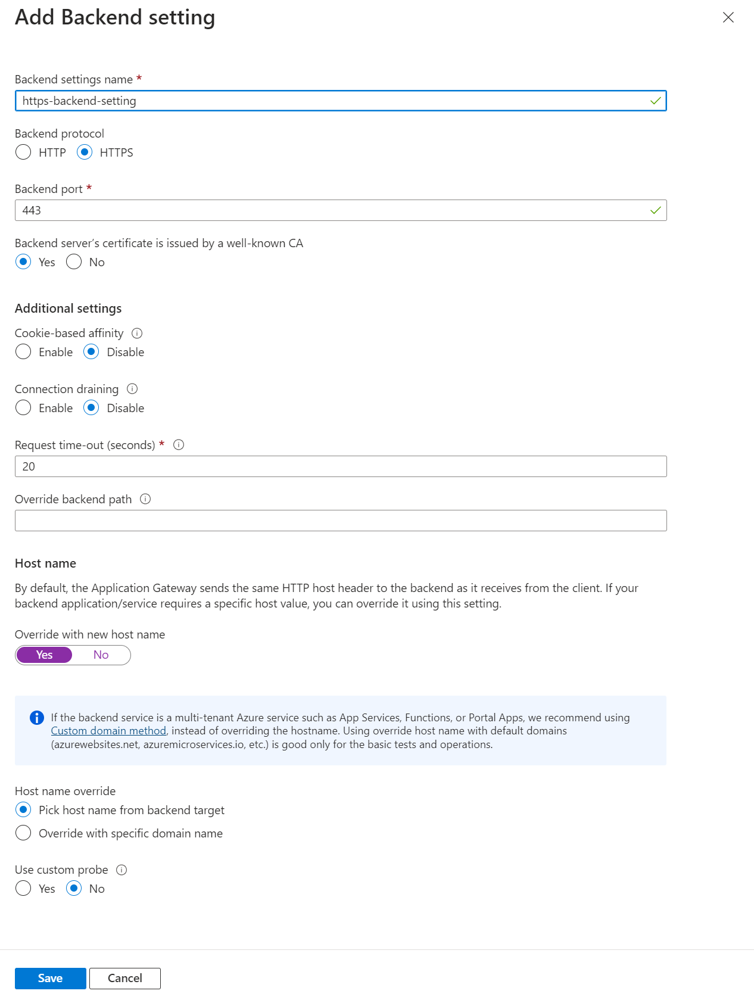
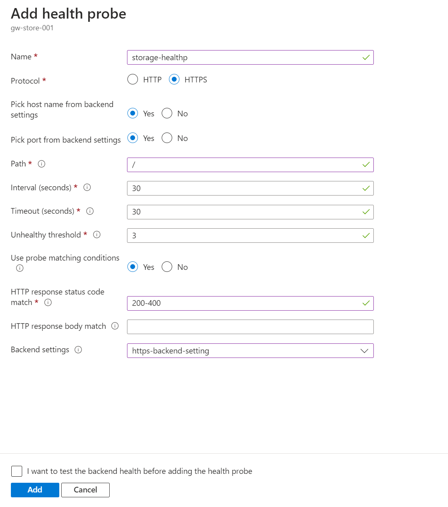
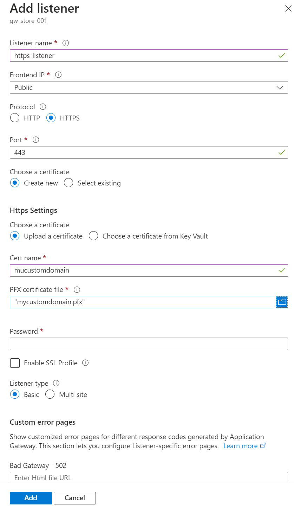
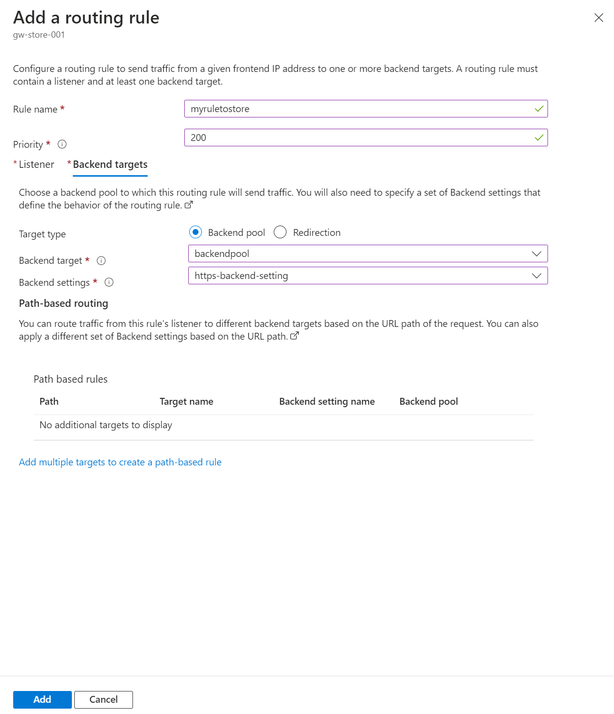
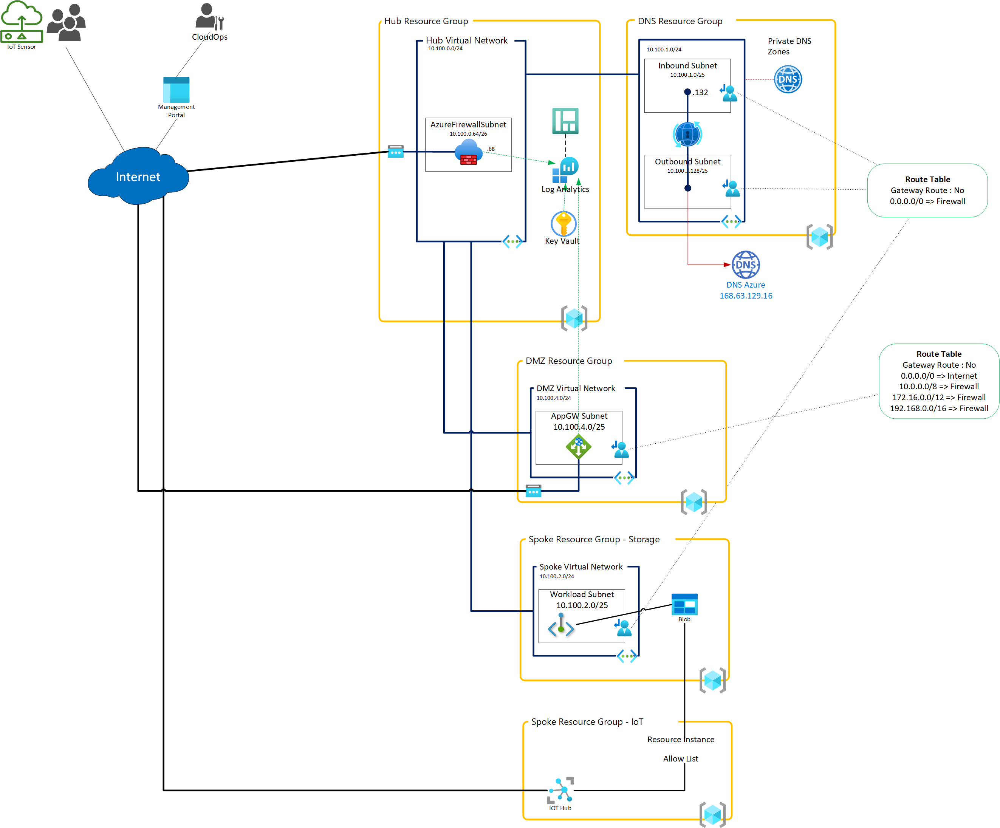
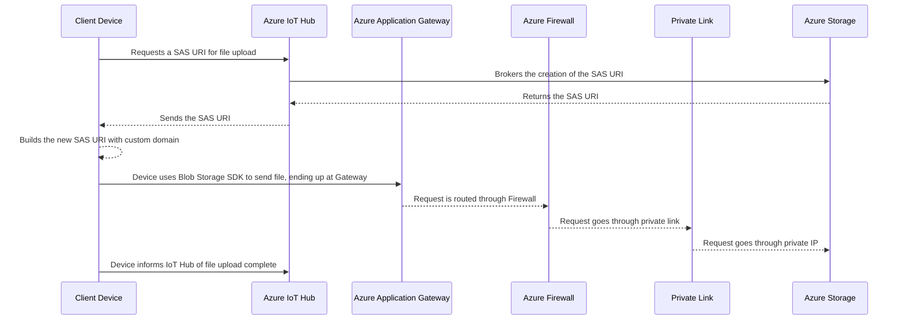

# Azure IoT Hub's File Upload to Storage with Private Endpoint and Firewall for traffic inspection

The file upload functionality provided by Azure IoT Hub serves as a secure bridge to the Azure Storage account. This eliminates the need for IoT client devices to rely on external custom services for secure connections to the Storage account. Instead, Azure IoT Hub exposes APIs to the client, handling this aspect seamlessly. For a comprehensive understanding of this feature, refer to the official  [Azure IoT Hub file upload overview](https://learn.microsoft.com/azure/iot-hub/iot-hub-devguide-file-upload).

This document offers guidance on securing Azure Storage account through a private endpoint while still allowing IoT Hub to interact with it, as well as allowing client IoT devices to reach the account through a gateway (Application Gateway and optionally Azure Firewall). With this approach the Storage account no longer allows public Internet access, which is a common requirement in enterprise deployments.

This sequence diagram illustrates the process of a client device uploading a file to Azure Storage via Azure IoT Hub. Here's a step-by-step breakdown:



## Moving towards an Azure Storage account without public Internet access

In regular deployments, because the Azure IoT client device needs to talk directly to the Storage account to upload the file, meaning this Storage account needs to allow incoming Internet traffic. Disabling Internet traffic would automatically block any client IoT devices from uploading files.

Customers with more stringent networking requirements may want to leverage a common practice of making the Azure Storage account accessible only from within a private network and inspect any traffic through a firewall or gateway. Often the implementation will be in the form of a **Hub-Spoke network topology**. The concepts for this architecture is discussed in the Azure architecture center article: Hub-spoke network topology in [Azure Architecture Center | Microsoft Learn](https://learn.microsoft.com/azure/architecture/networking/architecture/hub-spoke?tabs=cli).

In this article, we outline a strategy to enhance the security of Azure IoT Hub's file upload feature. This approach blocks direct internet traffic to the Storage account, permitting only the traffic routed through the inbound Application Gateway. This setup also enables traffic inspection via Azure Firewall for added security.

## Communication between Azure IoT Hub and Azure Storage account

Since Azure IoT Hub is unaware of this network restriction and doesn't support private endpoints for outbound traffic, it's necessary to maintain the brokering between Azure IoT Hub and the Storage account. This is possible through Azure Storage Networking configuration for [**Resource instances**](https://learn.microsoft.com/azure/storage/common/storage-network-security?tabs=azure-portal#grant-access-from-azure-resource-instances). This feature allows disabling public Internet access while still allowing Azure Services and specific instances of resources to connect through the Azure backbone. It works in combination with **Managed Identity**.

The Azure IoT Hub needs to be assigned a managed identity, and this managed identity needs to be assigned the role of `Storage Blob Data Contributor` to the specified Storage account.

Once managed identity and the role are assigned, associate the Azure Storage account to the IoT Hub: [Associate an Azure Storage account to IoT Hub](https://learn.microsoft.com/azure/iot-hub/file-upload-dotnet#associate-an-azure-storage-account-to-iot-hub). In this configuration, it's important to remember that it will only work with System-assigned managed identity as the authentication type.

## Azure Storage private endpoint

With communication between the Azure IoT Hub and Storage account configured, the next step is to ensure Azure Storage is set to disable Public Internet Access and create a Private Link endpoint which will be used for all traffic within the allowed Virtual Networks to connect to it.

It is also important to understand DNS impact when using Private Endpoints. When using a private endpoint, internal resolution of the Blob Storage endpoint will be resolved by using a DNS CNAME record. By default, when you create a Private Endpoint for an Azure resource, a private DNS zone is created automatically. You can also choose to customize this with your own DNS server on your network.

To create and configure Private Link for Azure Storage you can review this [tutorial](https://learn.microsoft.com/azure/private-link/tutorial-private-endpoint-storage-portal).

## Azure Application Gateway configuration

Azure Application Gateway will act as the entry point and load balancer for requests forwarded to the private endpoint of the Azure Storage account. We will use a Public IP address that can be mapped to an A record or CNAME at your custom DNS provider.

To configure Azure Application Gateway, follow one of the available [Quickstarts](https://learn.microsoft.com/azure/application-gateway/quick-create-portal) in the official documentation. After creation of the Application Gateway resource, let's update the settings to reflect a correct setup for connecting to the Azure Storage account.

In order to be able to configure the Application Gateway ensure:

* Have configured a Public IP address for the front-end configuration
* Have access to a custom DNS provider to configure your custom DNS or sub-domain entry
  * Use a CNAME pointing to the DNS of the Public IP address in Azure. This will be in the form of `xxx.region.cloudapp.azure.com`
* Have an SSL certificate in the form of .PFX file for the custom domain.

### Backend pool

The backend pool is the endpoint to which the gateway will send traffic to. Because of private DNS resolution, you can use the normal Blob endpoint as it will resolve to the <accountname>.privatelink.blob.core.windows.net which points to the private endpoint of the Storage account.



### Backend setting

Create the backend setting to send traffic to the backend pool using HTTPS.



### Health probe

Create a new health probe pointing to the Azure Storage account. It is important to note that the HTTP response status code match list must include 400. This is because the probe is pointing to `/` root of the Blob endpoint which will be returning a 400 status code.



### HTTPS listener

The listener is the entry point in the Application Gateway, and this is where you will need to setup TLS certificate settings. Ensure you have an SSL certificate for the domain name you are mapping your domain to.



### Application gateway Rule

Finally ensure the rule is set to the new listener, backend pool target and backend settings.



## Hub-Spoke networking topology with Azure Firewall

In the case you would like to setup Hub-Spoke networking topology, routing tables will ensure traffic from different Virtual Networks will  pass through  Azure Firewall for traffic inspection.

The configuration of the Storage account private endpoint, Azure IoT Hub and Application Gateway will be as describe in this article.

An example of such an architecture applied to this scenario would look like this:



There is a GitHub repo with a set of Terraform modules to help you with the creation of such a Hub & Spoke topology created by Vincent Misson, co-author of this article: [Terraform Azure Resources](https://github.com/azurerm/terraform-azure-resources?tab=readme-ov-file#network-design).

## Providing Client device with the custom Azure Storage domain

In some way or another, the device will need to be informed about the requirement to use a custom DNS overwriting the default blob storage URI retrieved via Azure IoT Hub's endpoint. There can be multiple ways of sending this information to the client, and in this example we have chosen to put this information in a Desired Twin property. Whenever the custom domain name would change, Desired Twin property for the concerned devices would need to be updated, but no hard-coded settings on the client itself are affected.

Example of the Device Twin Desired property:

```json
 "properties": {
    "desired": {
        "storage": {
            "customdns": "mystore.mycustomdomain.com"
        },
    }
}

```

The device retrieves the `customdns` field from the Desired Twin and can use code for replacing the default Azure blob storage endpoint with this custom domain.

You can view a sample of such retrieve and replace in the sample client code in the file [`Program.cs`](../src/SampleIoTClientFileUpload/Program.cs)

The final high level flow for the file upload now looks like this:



## Conclusion

This document presents a method to secure an Azure Storage account, effectively blocking public internet access while still permitting internet-based devices to upload files. This is achieved by utilizing a custom DNS and routing traffic through an Application Gateway and Firewall.

We also discuss the specific configuration needed to maintain access for the Azure IoT Hub account to the private Storage account. This is accomplished by leveraging Resource Instance permissions and managed identity.
